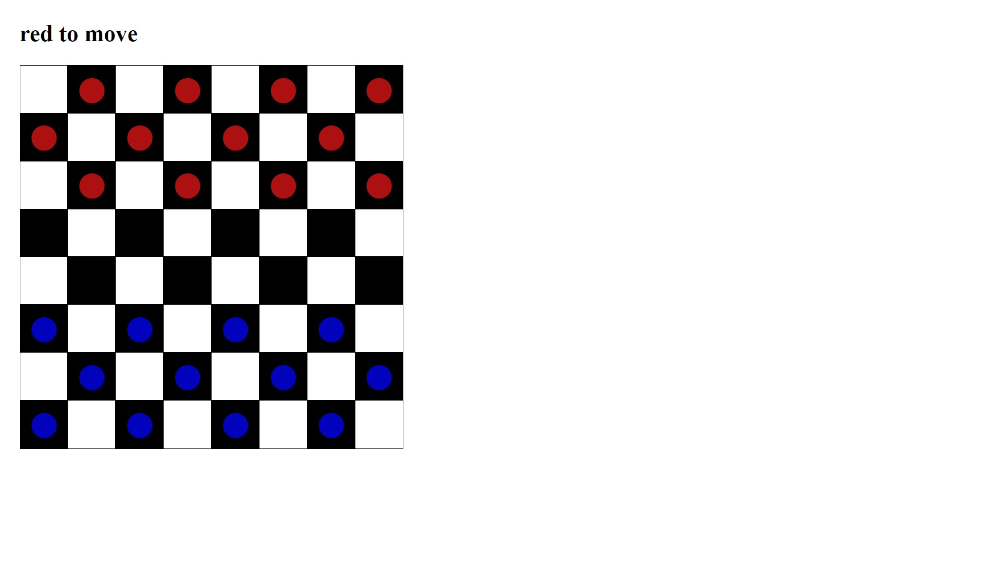
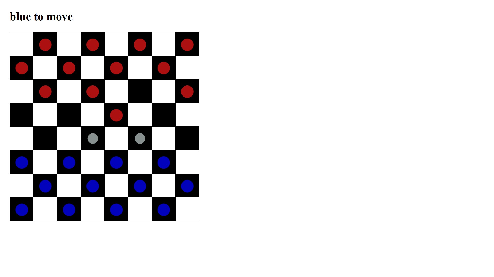

# Checkers implementation using React

## In development
 This project is currently in development. Right now it allows the user to move pieces. 
 Taking the opponent's piece is not yet implemented.

## Screenshots



## Demo
[Checkers demo](https://vladmidir.github.io/checkers-react/)

## Structure
- The App consists of Game, Board, Squares, and Pieces.
- Game keeps track of whose turn it is, passing props to Board.
- Board has a 'board' state that is a 2-dimensional array. Each cell in the array is assigned to a Square.
- Squares are updated when the board changes (since the board is a state).
- Each Square has a Piece, which is either red, blue, grey highlight (possible move), or empty.
- Board decides which Square are allowed to move (has piece & their turn).
- Board tells which Squares to highlight (onClick if the checker is allowed to move, highlight possible moves). 
- The Board calculates moves based on the board state. Recalculate highlights on every click.
- If a highlighted square is clicked, make the move updating the board. 
- After every move, Game checks for Winner (not yet implemented).

## Purpose
The goal of this project is to familiarize myself with React app structure. 
So far it has helped me understand how to use a parent component to manage a child's 'state' via props.
Another thing I learned (among others) is how a child can be updating the parent's components by passing a function from the parent as a
prop to the child. 
```js
export default function Game(){

    function makeMove(){
      setRedToMove(!redToMove)
    }
    return( 
    <>
      <Board 
      moveMade={makeMove}
      ></Board>
    </>)
}
```
